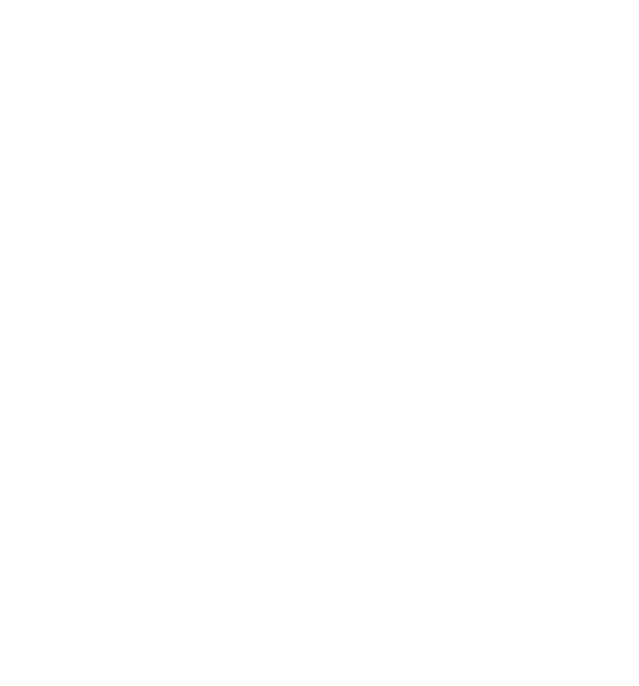
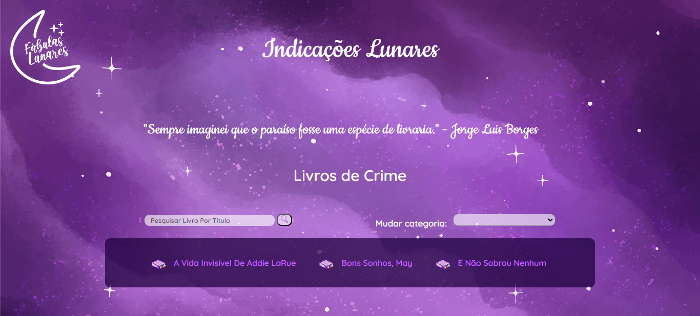

<h1 align="center"> INDICAÇÕES LUNARES (em desenvolvimento) </h1>

Projeto autoral em desenvolvimento  
 

 

</img>

  <a href="#-sobre-o-projeto">Sobre o projeto</a>&nbsp;&nbsp;&nbsp;|&nbsp;&nbsp;&nbsp; 
  <a href="#-layouts">Layouts</a>&nbsp;&nbsp;&nbsp;|&nbsp;&nbsp;&nbsp;
  <a href="#-tecnologias">Tecnologias</a>&nbsp;&nbsp;&nbsp;&nbsp;&nbsp;&nbsp;

 

# Sobre o projeto

Indicações Lunares é uma página web programada utilizando o framework django e a linguagem python. Os usuários poderão indicar livros, procurar indicações por categoria, filtrar pesquisa por título, encontrar informações sobre os livros indicados e visualizar as últimas indicações que são exibidas em um carrossel no final da página home. 

Para o projeto foi utilizado o ambiente virtual. 

</img>

# 📸 Layouts 

Home

</img>

Tela de categorias

</img>
 

Tela que exibe informação dos livros

</img>
 

Tela do formulário para indicação

</img>
 

  

## 🚀 Tecnologias

Esse projeto foi desenvolvido com as seguintes tecnologias:
- Django
- Python
- Banco de Dados
- HTML
- CSS
- Git e Github

# Autor

Lavínia Souza Silveira

https://www.linkedin.com/in/lav%C3%ADnia-silveira-896b2624a/
